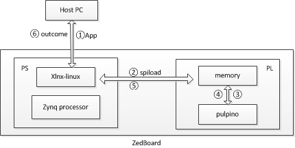

## spi设备

PULPino 和 linux 启动后，增加了/dev/spidev32766.0。

我们可以通过该设备从linux向pulpino的任意存储介质中发送数据，从而控制PULPino的运行。
如下图Figure-1所示，spiload同该设备实现步骤2,5。

Figure-1  

### 1.确认连线

在$HOME/fpga/pulpemu/ps7_bd.tcl中，spi已经进行了连线，
比如，***connect_bd_net -net SPI0_MISO_I_1 [get_bd_ports SPI0_MISO_I]
[get_bd_pins processing_system7_0/SPI0_MISO_I]***

    # notice: $HOME为PULPino的目录

### 2.设备初始化

**A. fsbl**

Nothing

**B. uboot**

有些底层初始化函数，比如 xilinx_spi.c zynq_xpi.c等

**C. device tree**

在zynq-7000.dtsi中，有spi0和spi1的描述。Linux将会根据dts中的描述，创建相应的设备，
/proc/device_tree显示了读取的结果

**D. 创建设备**

PULP使用了SPI接口进行通信，用来将程序加载到

### 3.设备访问

**A. spi协议**

**B. spi驱动**

**C. spi设备访问**
